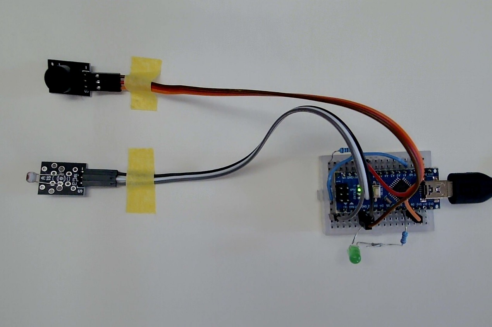
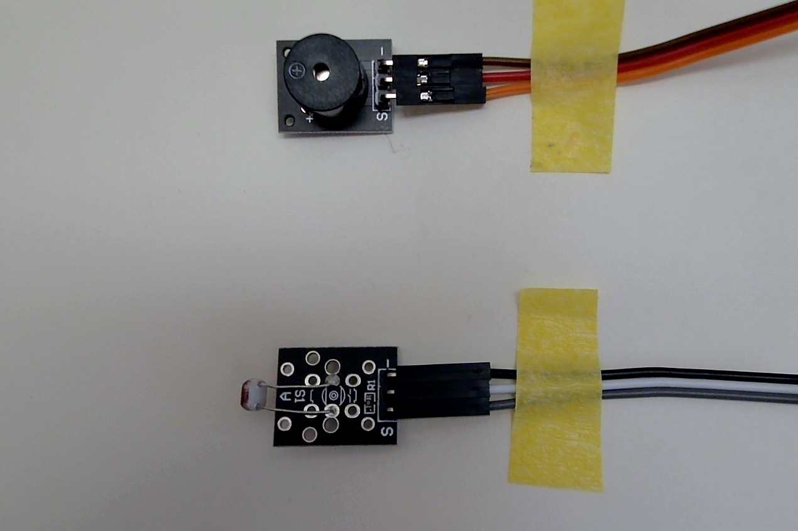
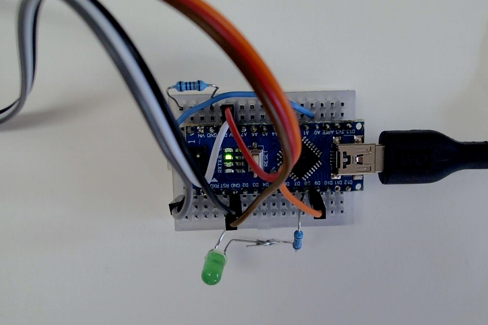
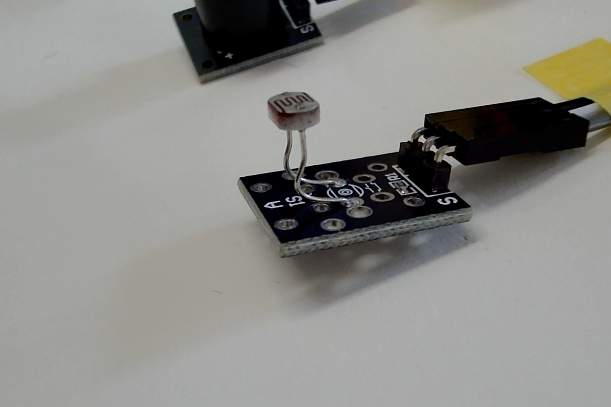
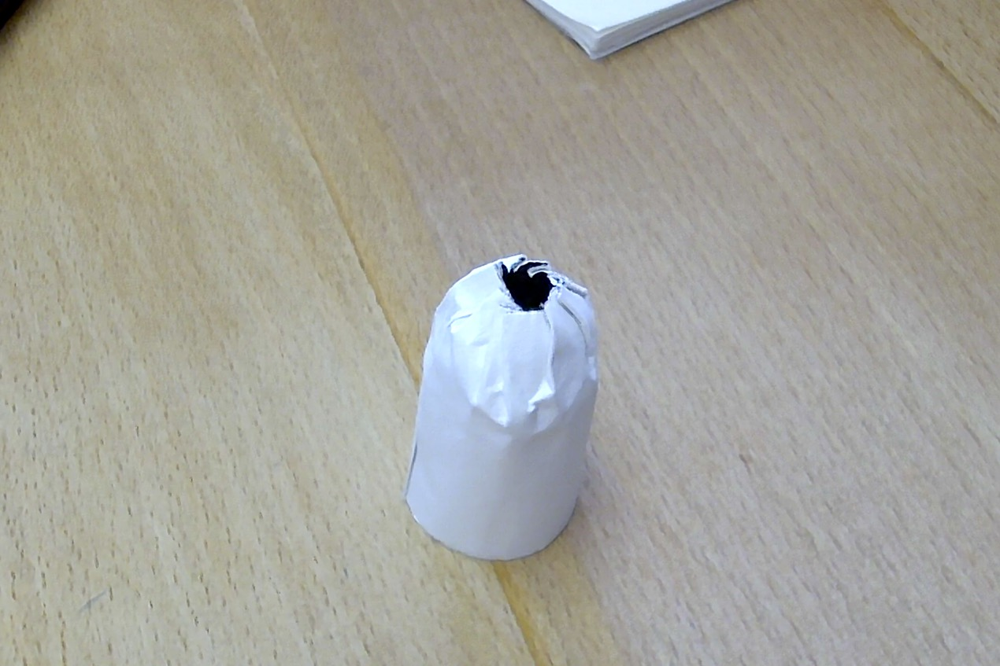
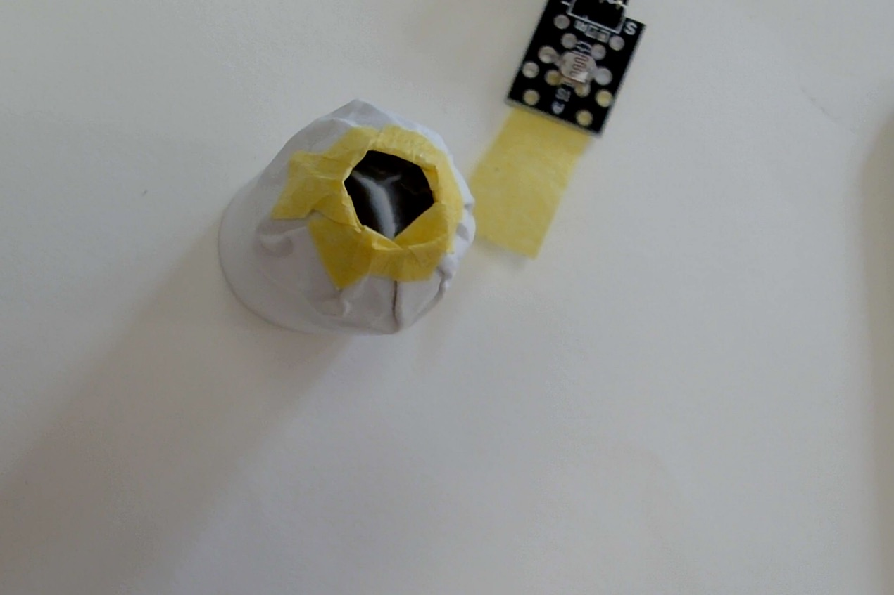
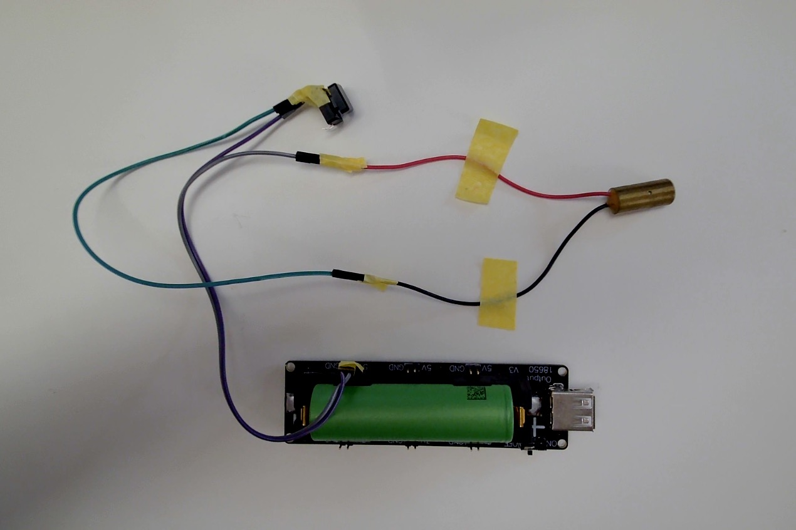
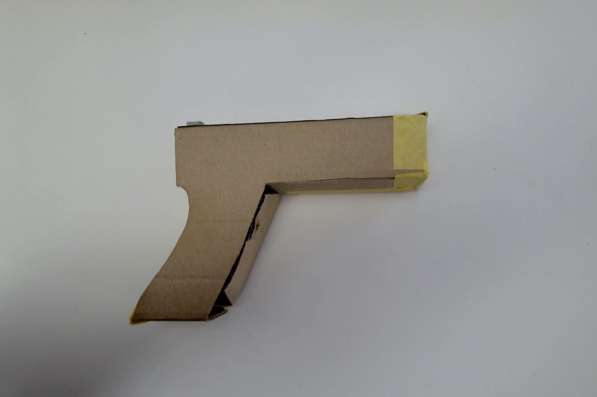

# Physical Shooting Game 
<small> with Arduino Nano </small>

## Table of Contents 

- [Motivation](#motivation)
- [What we need](#what-we-need)
- [Wiring - Target](#wiring---target)
- [Code](#code)
- [Adjust threshold](#adjust-threshold)
- 

---
## Motivation

One day I saw this [web page](https://www.gizmodo.jp/2024/10/machi-ya-varishot-review_repost-796522.html) on GIZMODO, reporting a physical shooting game with physical target and toy pistols with a laser pointer installed inside. It reminds me of my enthusiasm on chopsticks guns [(somethign like this)](https://blog.cfms.jp/?p=10323) with rubber bands. I was not interested in shooting 'enemy' 
or anything that moves. I was not interested in any battles either (affirmatively hate them), but was purely interested in shooting a target. I was and still am fascinated in the precision of a mechanism. 

This 'VariShot' is quite expensive. In Europa it costs over 600 Euros. I can imagine, importing such toys will require a tons of explanations at a Zollamt. 

Okay, let us create one. 


---
## What we need

For a target,

- Arduino Nano
- USB mini-B (to write code on Arduino Nano)
- photoresistor (LDR: Light Dependent Resistor) 
- LED
- active speaker
- Resistor (220 Ω. For LED)
p- Resistor (10 kΩ. For photoresistor)
- wires and pins
- Aluminum tape (to make a physical target)

For a pistol
- red laser
- Li-ion battery 18650
- button switch
- cardboard
- wires and pins

and my Charlie (= ChatGPT) will write a code. 


---
## Wiring - Target



Connect the signal lines as follows. 

|                 |    |
|-----------------|----|
| photoresistor   | A0 |
| active speaker  | D9 | 
| LED             | D8 |

For the photoresistor, make sure to insert 10 kΩ between the 
signal line and the ground. The left most column of the breadboard 
in the picture was used to connect LDR 'S' and 10 kΩ.

```sh
    5V
    | (white line in the picture above)
    |
    |     (black. labeled with '-')
 [ LDR ] ---> GND
    |
    | (gray. 'S')
    |-------> A0 (Analog Input)
    |
 [10 kΩ]
    |
   GND
```

For the LED, put 220 Ω between '+' and 5V. 
```sh
    5V
    | 
    | 
 [220 Ω]
    |
    | (longer leg)
 [ LED ] 
    | (shorter leg)
    |
   GND
```




---
## Code

The directory structure is 

```sh
$ tree . -L 2
.
├── images
│   ├── board-1.png
│   ├── wiring-1.jpg
│   ├── wiring-2.jpg
│   └── wiring-3.jpg
├── LICENSE
├── nano_shooting
│   └── nano_shooting.ino
└── README.md

3 directories, 7 files
$
```

Upload the code ```nano_shooting.ino```. 

**Note** The board, port and processor settings are as follows. 
The port will be different from yours. 

|                 |              |             | 
|-----------------|--------------| ------------|
| Board           | Arduino Nano | 
| Port            | /dev/cu.usbseriral-1410 | for my MacBook |
| Processor       | ATmega328P (Old Bootloader) | pick 'Old...' one|


In case  you got this kind of error message, press the reset button 
on Nano (small white rectangular button in the middle).

```sh
Sketch uses 3984 bytes (12%) of program storage space. Maximum is 30720 bytes.
Global variables use 320 bytes (15%) of dynamic memory, leaving 1728 bytes for local variables. Maximum is 2048 bytes.
avrdude: stk500_getsync() attempt 1 of 10: not in sync: resp=0x4c
avrdude: stk500_getsync() attempt 2 of 10: not in sync: resp=0x44
...
Failed uploading: uploading error: exit status 1
```

---
## Adjust threshold

The photoresistor outputs an analog signal between 0 and 1023, 
the brighter the light it receives, the smaller the signal. 

To avoid the speaker and the LED being activated with ambient light, 
we have to set the threshold correctly. 

Uncomment the line ```Serial.println(v);``` and upload the code 
again. Open serial monitor and measure the ambient brightness, 
and the hit brightness (use your laser point to illuminate the photoresistor). 


```cpp
...
void loop(){
  // read the LDR and average the signal
  int v = readA0Avg();
  // uncomment to measure the anbient light. 
  Serial.println(v);  
...  
```

Then set the following parameters. 

```cpp
...
// ---- thresholds. need to adjust 
int onThr  = 96;  // if smaller than this, counted as a hit.
int offThr = 128;  // if larger than this, target is reset (= ready to get shot).
...
```


---
## Make Target

Bend the legs of the photoresistor slowly so that 
it directs front, so that it is easier to install the target 
on the wall. 



To increase the size of the target, we use aluminum tape. 
Just like you make pleats the edges of [gyoza](
https://en.wikipedia.org/wiki/Jiaozi).



Make sure that the aluminum tape does not short the photoresistor!



---
## Wiring - Pistol



The red laser works with 5V input.

[Glock](https://de.wikipedia.org/wiki/Glock-Pistole) model. 



Put the laster inside the cardboard housing. 


Worked. 

Test shooting. 


Satisfied. 

---
# END
---
